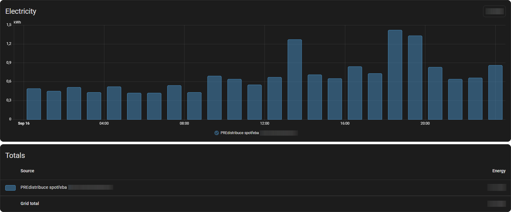
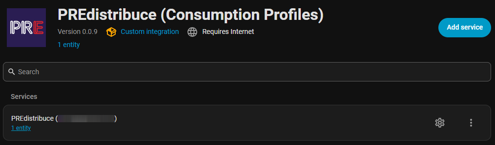
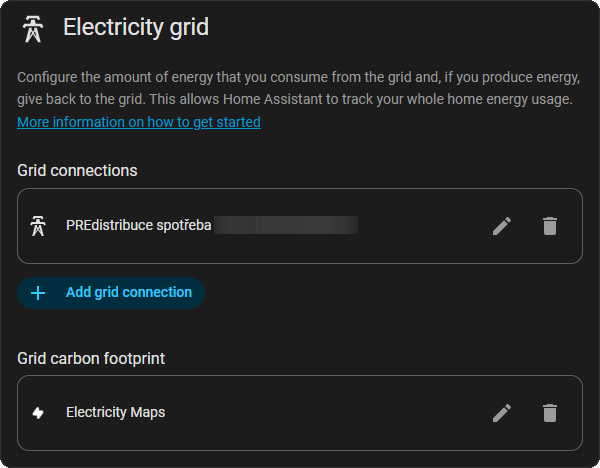
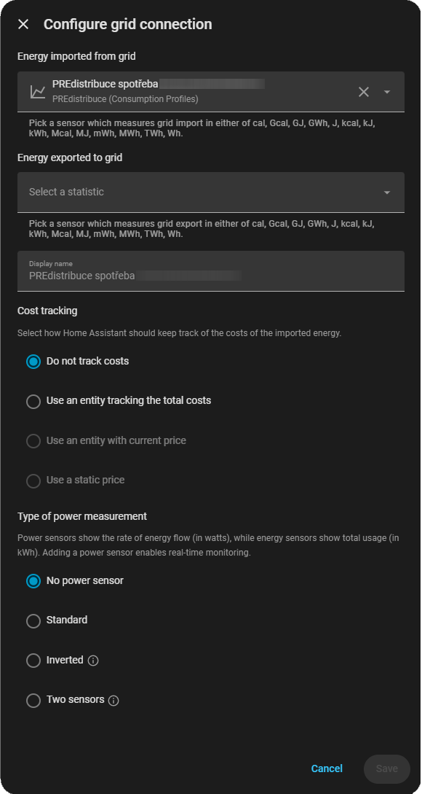
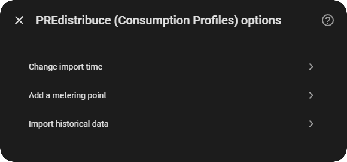
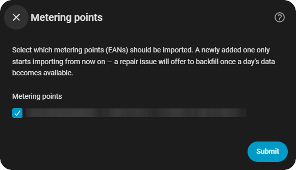
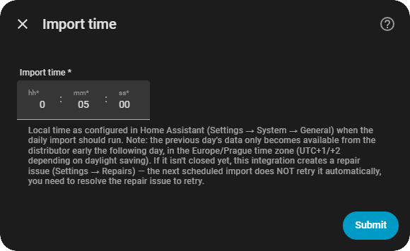
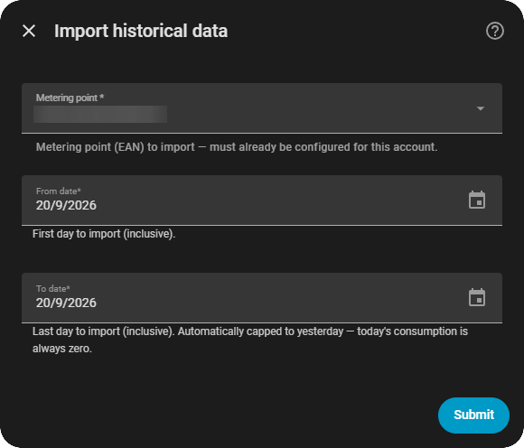
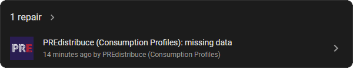

# PREdistribuce — Profily spotřeby

[English version](README.md)

[](https://github.com/hondzik/predistribuce-consumption-profiles/releases)
[](LICENSE)
[](https://github.com/hondzik)
[](https://github.com/hondzik/predistribuce-consumption-profiles/commits/main)

Vlastní integrace pro Home Assistant, která se přihlásí do klientského portálu [PREdistribuce](https://www.predistribuce.cz/) (distributor elektřiny pro Prahu), stáhne z chytrého elektroměru čtvrthodinový profil spotřeby za předchozí den a naimportuje ho do Home Assistantu jako dlouhodobou **externí statistiku** — takže se objeví v **Energy dashboardu** stejně jako u běžného energetického senzoru.



## Obsah

- [Jak to funguje](#jak-to-funguje)
- [Požadavky](#požadavky)
- [Instalace](#instalace)
- [Konfigurace](#konfigurace)
  - [Prvotní nastavení](#prvotní-nastavení)
  - [Přidání statistiky do Energy dashboardu](#přidání-statistiky-do-energy-dashboardu)
  - [Přidání dalšího odběrného místa později](#přidání-dalšího-odběrného-místa-později)
  - [Změna času importu](#změna-času-importu)
  - [Manuální import historických dat](#manuální-import-historických-dat)
- [Chybějící / ještě neuzavřené dny](#chybějící--ještě-neuzavřené-dny)
- [Známá omezení](#známá-omezení)
- [Řešení problémů](#řešení-problémů)
- [Verzování a vydávání](#verzování-a-vydávání)
- [Upozornění](#upozornění)
- [Poděkování](#poděkování)

## Jak to funguje

PREdistribuce nenabízí veřejné API pro data o spotřebě — tato integrace se přihlašuje do stejného klientského portálu (`www.predistribuce.cz`), jaký by použil člověk v prohlížeči, vyžádá sestavu „Profily spotřeby" za předchozí den a naparsuje CSV export, který portál vrátí.

Jednou denně, v čase, který si zvolíte, integrace:

1. Přihlásí se a stáhne čtvrthodinové hodnoty spotřeby za včerejšek pro každé nakonfigurované odběrné místo (EAN).
2. Agreguje je na hodinové součty a zapíše je do databáze statistik Home Assistantu přes `async_add_external_statistics`, takže se objeví jako dlouhodobá statistika (`predistribuce:<EAN>_consumption`), kterou lze v Energy dashboardu použít jako zdroj spotřeby ze sítě.
3. Pokud portál ještě nedokončil uzavření požadovaného dne (spotřeba je stále celá nulová), den se přeskočí a zapamatuje — viz [Chybějící / ještě neuzavřené dny](#chybějící--ještě-neuzavřené-dny).

## Požadavky

- Instance Home Assistant, do které lze nainstalovat vlastní integrace (HACS nebo manuální kopie do `custom_components/`).
- Aktivní účet na klientském portálu PREdistribuce (stejné přihlašovací údaje jako na predistribuce.cz) s alespoň jedním odběrným místem.

## Instalace

### Přes HACS (doporučeno)

[](https://my.home-assistant.io/redirect/hacs_repository/?repository=predistribuce-consumption-profiles&owner=hondzik&category=Integration)

Pokud ještě není v výchozím obchodě HACS, přidejte tento repozitář manuálně v HACS jako **vlastní repozitář** (kategorie: *Integration*), pak nainstalujte „PREdistribuce" ze seznamu integrací a restartujte Home Assistant.

### Manuálně

Zkopírujte `custom_components/predistribuce` z tohoto repozitáře do adresáře `config/custom_components/` vaší instance Home Assistant a restartujte ji.

## Konfigurace

Konfigurace probíhá výhradně přes uživatelské rozhraní Home Assistant (Nastavení → Zařízení a služby → Přidat integraci → „PREdistribuce") — žádná YAML konfigurace není potřeba.

### Prvotní nastavení

1. Zadejte přihlašovací jméno/e-mail a heslo k portálu PREdistribuce.
2. Vyberte, které odběrné místo/místa se má/mají importovat, a čas, kdy se má denní import spouštět.

Přihlašovací údaje se ukládají standardní cestou Home Assistantu (uvnitř config entry, stejně jako u jiných cloud-polling integrací) — nikam jinam se nezapisují. Po nastavení se integrace objeví v Nastavení → Zařízení a služby:



### Přidání statistiky do Energy dashboardu

Přidejte statistiku `predistribuce:<EAN>_consumption` jako zdroj spotřeby ze sítě v Nastavení → Dashboardy → Energetika → Elektrická síť:





Další možnosti pro už nakonfigurovaný účet jsou dostupné přes tlačítko **Konfigurovat** u integrace:



### Přidání dalšího odběrného místa později

Zvolte **Odběrná místa** a vyberte další EAN(y) na účtu. Uložené heslo se použije automaticky — nebude se znovu vyžadovat.



### Změna času importu

Zvolte **Rozvrh** pro změnu hodiny/minuty, kdy se denní import spouští.



### Manuální import historických dat

Pro (znovu)stažení konkrétního rozsahu dat u konkrétního odběrného místa — například pro doplnění dat zpětně od doby před nastavením integrace, nebo pro vynucení opakování mimo denní rozvrh — zvolte **Importovat historická data**. Vyberte odběrné místo a rozsah od/do data a odešlete; výsledek ukáže, kolik hodinových záznamů se naimportovalo (0 obvykle znamená, že distributor požadovaný den/dny ještě neuzavřel).



Stejná operace je dostupná i jako akce/service Home Assistantu `predistribuce.import_historical_data` (Nástroje pro vývojáře → Akce), která přijímá config entry, EAN a rozsah `date_from`/`date_to` — vhodné pro skripty a automatizace. Výše popsaný krok v options flow je jen tenký formulář postavený nad touto stejnou akcí.

## Chybějící / ještě neuzavřené dny

PREdistribuce nikde nepublikuje pevný čas, kdy jsou data o spotřebě za daný den finální — elektroměr je zjevně odesílá zhruba jednou denně, ale přesný okamžik uzavření nikde zdokumentovaný není. Integrace proto z bezpečnostních důvodů:

- Nikdy nežádá data za dnešní den, jen za dny striktně v minulosti.
- Den, jehož sloupec spotřeby je *celý nulový*, považuje za „ještě neuzavřený" (namísto naimportování nul) a zapamatuje si ho.
- Vytvoří **repair issue** („PREdistribuce: chybějící data"), zobrazenou jako odznak v Nastavení a v přehledu Nastavení → Systém → Opravy, s popisem, které EAN/den chybí.
- Repair issue je opravitelná: kliknutím na **Opravit** se na vyžádání znovu zkusí stáhnout všechny chybějící dny/EANy. Pokud distributor den pořád nemá uzavřený, issue zůstane otevřená; jakmile se stažení podaří, automaticky zmizí. Další naplánovaný denní běh to zkusí také automaticky, nezávisle na repair issue.



## Známá omezení

- **Dodávka do sítě (`-A`, např. z fotovoltaiky) ještě není podporována.** Nebylo možné ji ověřit proti reálnému odběrnému místu typu výroba — podpora je plánovaná, jakmile bude k dispozici.
- **Přechod letního/zimního času je implementovaný, ale ještě neověřený proti reálným datům.** Zacházení s „fold" při přechodu (`zoneinfo`, `Europe/Prague`) by mělo být správné, ale potvrdí se až při reálném přechodu (nejbližší: 25. 10. 2026).
- Popisky adres odběrných míst (zobrazované u EAN při výběru) se parsují nejlepším možným způsobem z HTML portálu a mohou se degradovat na zobrazení jen EAN, pokud se struktura portálu neshoduje s očekáváním.
- Tato integrace je neoficiální a závisí na struktuře veřejného klientského portálu, kterou může PREdistribuce kdykoliv bez upozornění změnit.

## Řešení problémů

- **Přihlášení opakovaně selhává / integrace vyžaduje nové přihlášení** — Home Assistant automaticky nabídne opětovné přihlášení (Nastavení → Zařízení a služby), pokud se změní heslo nebo přihlášení do portálu začne selhávat. Zadejte tam své aktuální heslo k portálu.
- **V Energy dashboardu se nic nezobrazuje** — ověřte, že je statistika `predistribuce:<EAN>_consumption` přidaná jako zdroj spotřeby ze sítě v Nastavení → Dashboardy → Energetika, a zkontrolujte, zda není aktivní oznámení o chybějících datech (viz výše).
- **Zapnutí debug logování** — do `configuration.yaml` přidejte:

  ```yaml
  logger:
    logs:
      custom_components.predistribuce: debug
  ```

## Verzování a vydávání

Verze (podle [Semantic Versioning](https://semver.org/)) a vydání se generují automaticky z [Conventional Commits](https://www.conventionalcommits.org/) na větvi `main` pomocí [release-please](https://github.com/googleapis/release-please) — ten otevře „release pull request", který zvýší verzi v `manifest.json` a doplní `CHANGELOG.md`, a po jeho sloučení vytvoří otagované vydání na GitHubu.

## Upozornění

Projekt nemá žádnou vazbu na PREdistribuce, a.s. Používání je na vlastní riziko; před nasazením do produkčního provozu doporučujeme ověřit podmínky užití portálu ohledně automatizovaného přístupu.

## Poděkování

Inspirováno projektem [HACS_CEZD_PND](https://github.com/igracek/HACS_CEZD_PND) (obdoba pro ČEZ Distribuci).
